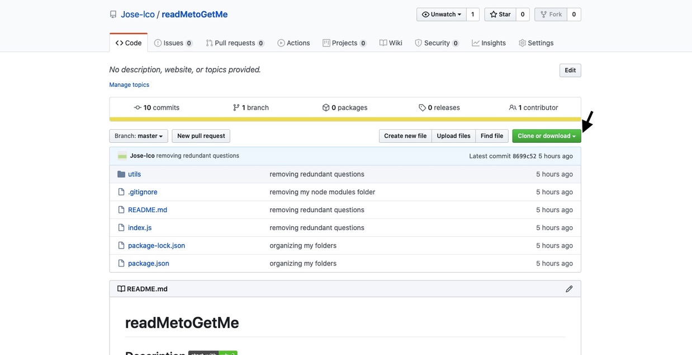

# takeNotesppl

## Description [](http://www.ted.com/talks/simon_sinek_how_great_leaders_inspire_action)

AS a user, I want to be able to write and save notes. I also want to be able to delete notes I've written before so that I can organize my thoughts and keep track of tasks I need to complete. In a business context I would like to take notes of important points I would need later in the future.

## Table of Contents

* [Installation](#installation)
* [Usage](#usage)
* [Contributing](#contributing)

## Technologies used

* Javascript
* Node.js
* Express.js
* HTML 
* CSS 

## Installation

1. The first step would be to clone the link of the repository. This can be done by clicking the green button on the top right of this repository.


2. Go to your terminal on your computer and run this command in the folder that you would like to generate the README.
```bash
git clone https://github.com/Jose-lco/takeNotesppl
```
3. Open the folder with the repository. The first thing you would do is to install the dependencies. In order to do this, you would run npm install in the command line.
```
npm install 
``` 
4. To officially run the application, run this in the command line:
```bash
node server.js
```
## Usage

This is an application that can be used to write, save, and delete notes. This application will use an express backend and save and retrieve note data from a JSON file.

 

## Contributing [](https://github.com/Jose-lco/undefined/issues)

yes you can make contributions to this project and report any issues. If you would like to make a contribution to the application, the green badge above will direct you to the issues page for this repository and you can submit your issue there.

## License

This project is licensed under ISC

## Acknowledgements
I used this repository to learn about badges: 
[dwyl repo-badges](https://github.com/dwyl/repo-badges)

## Authors

**This project was created by:**
* Jose-lco [](http://hits.dwyl.com/Jose-lco/takeNotesppl)
  * Contact info: [Linkedin profile](www.linkedin.com/in/josephine-ndungu-a0a441160)
